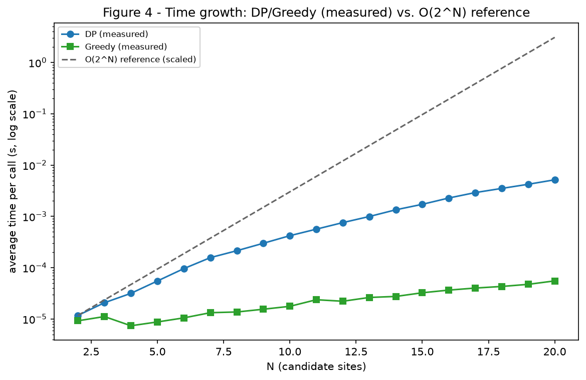

# Complexity Analysis

## Question 1

### 1. Parameters

All bounds below are expressed in the problem's own parameters, not in an
abstract "n":

- **V**: number of nodes = 1 depot + `N_SITES` = 21 for the seed-1 dataset.
- **E**: number of *available* roads (blocked roads are excluded from the
  graph passed to Dijkstra, D6) = 38 for the seed-1 dataset.
- **N**: number of *candidate* sites, i.e. those reachable from the depot
  and present in the canonical order `pi` (D9) = 20 for the seed-1 dataset
  (every site happens to be reachable).
- **C**: vehicle capacity, an integer number of load units (D1) = 581 at
  the notebook's default `CAPACITY_FRACTION = 0.35` (581 = floor(0.35 x
  1662), the seed-1 total load).

### 2. Preprocessing: Dijkstra, the distance matrix and pi

Both solvers need the same two things first, computed once and shared
(D15): the pairwise distance matrix and the canonical order `pi`.

- **`dijkstra`** (`shortest_paths.py`): a single run is `O((V + E) log V)`
  time (binary heap, up to `E` push/relax operations, each `O(log V)`)
  and `O(V + E)` memory (`distance`, `parent`, `visited`, plus the heap).
- **`distance_matrix`**: one Dijkstra per source, for depot + every
  candidate: `O(N * (V + E) log V)` time, `O(N * V)` memory (one distance
  dict per source).
- **`build_order`** (pi, D9): a single DFS over the shortest-path tree,
  `O(V log V)` (the `log V` comes from sorting each node's children by
  `(distance, id)`; the traversal itself is `O(V)`). Recursion depth is
  the tree height, up to `O(V)` in the worst case (a single chain) --
  harmless at V = 21, but not a pattern to rely on for much larger V.

On the seed-1 dataset a single `dijkstra` call measures **~0.000012 s**;
the 20-call `distance_matrix` behind both solvers costs about 20x that,
still under a millisecond -- negligible next to the DP itself (below).

### 3. Greedy (`greedy.py`, Decision D12)

- **State count is not the right lens here**: Greedy does not fill a
  table: it runs an outer loop that selects at most `N` sites (one per
  successful round), each round scanning the up to `N` remaining
  candidates.
- For each candidate, `marginal_gain` calls `_pi_neighbors`, which scans
  the current `selected` list (up to `N` sites) to find the candidate's
  pi-predecessor/successor: `O(N)` per candidate.
- **Time**: `N` rounds x up to `N` candidates x `O(N)` per marginal-gain
  call = **`O(N^3)`** worst case. `_insert_in_pi_order` (`O(N)` per
  insertion) and `sorted(remaining_candidates)` (`O(N log N)` per round)
  are dominated by the `O(N^3)` term and do not change the bound.
- **Memory**: `pi_rank`, `benefit`, `load`, `selected` and
  `remaining_candidates` are all `O(N)`; no table is kept. **`O(N)`**
  total, on top of the shared `O(N * V)` distance matrix.
- **Recursion depth**: none -- Greedy is iterative.
- **Temporary copies**: `sorted(remaining_candidates)` allocates a new
  list every round (`O(N)` each, `O(N)` rounds -> `O(N^2)` cumulative
  temporary allocations, distinct from the `O(N)` *peak* memory above,
  since each temporary is discarded before the next is created).
- **Worst case**: `O(N^3)` is also the typical case here -- the loop
  always runs until no eligible candidate remains, so there is no
  early-exit input that is asymptotically cheaper. At `N = 20` this is
  fast in absolute terms (measured **~0.00005 s**, see Section 6), but
  the cubic term is what would dominate if `N` grew substantially.

### 4. Dynamic Programming (`dynamic_programming.py`, Section 4)

- **State count**: `dp[i][c]` for `i` in `0..N-1` and `c` in `0..C`, i.e.
  `N * (C + 1)` states -- for the seed-1 dataset, `20 * 582 = 11640`
  states.
- **Cost per transition**: filling one state `dp[i][c]` considers the
  base case (O(1)) plus up to `i` predecessors (`j < i`), each an O(1)
  lookup and comparison: `O(N)` per state in the worst case (large `i`).
- **Time** (states x cost per transition, Lesson 14's rule): `N * (C+1) *
  O(N)` = **`O(N^2 * C)`**. For the seed-1 dataset, `N^2 * C =
  20^2 * 581 = 232400` -- and the measured time is **~0.0053 s**
  (Section 6), consistent with a small constant factor per state.
- **Memory**: `dp` and `predecessor` are both `N x (C+1)` -> **`O(N *
  C)`**; measured peak **~316 KB** at N=20, C=581 (`tracemalloc`).
- **Recursion depth**: none -- the DP is bottom-up (iterative), which is
  exactly why it was chosen over a top-down/memoized version (Lesson 09):
  a recursive formulation would add up to `O(N)` stack depth for no
  benefit, and would only fill the states it actually visits, leaving an
  incomplete table for Figure 3.
- **Temporary copies**: none beyond the two tables themselves; the inner
  loop only reads already-computed cells, no row or column is rebuilt.
- **Worst case**: `O(N^2 * C)` for every input -- the DP always fills the
  same number of states regardless of the data (unlike Greedy, there is
  no early stop).
- **Pseudo-polynomial remark**: `C` enters the bound by its *value*, not
  by the number of bits needed to represent it (`log C`). Doubling `C`
  roughly doubles the running time, even though `C`'s encoding only grows
  by one bit -- this is why `C` is kept as a small integer (hundreds of
  load units, D1), never as a large or fractional quantity: a
  polynomial-*looking* bound can still be practically exponential in the
  input's bit length if `C` is allowed to grow unchecked.
- **Full table vs. reduced vector, and what is lost**: the classic
  0/1-knapsack trick of shrinking `dp[item][capacity]` down to a single
  `dp[capacity]` vector relies on row `i` depending *only* on row `i-1`
  (so old rows can be overwritten once consumed, iterating capacity in
  reverse). **That trick does not apply to this DP**: the recurrence
  `dp[i][c] = b_i + max_{j<i}(...)` lets *any* earlier site `j`, not just
  `i-1`, be the direct predecessor of `i` (a direct consequence of `pi`
  turning the candidates into a DAG with an edge from every earlier node
  to every later one, D5). Reducing to `O(C)` memory would therefore
  need to keep effectively all previous rows anyway, so `O(N * C)` is
  already the minimum needed for correctness here -- not only for
  reconstruction, which is the usual reason to keep the full table.

### 5. Brute force reference (`2^N`)

The assignment asks the DP to be compared against a `2^N` brute-force
enumeration of every subset of candidates (Lesson 12, Cell 07). Running
an actual `2^N` solver up to `N = 20` (over a million subsets, each
needing an `O(N)` route-length computation) was not implemented as
production code -- Rule 8 forbids ready-made optimization solvers, but
also, more practically, it would take orders of magnitude longer than
the DP it exists to contrast with, without adding information beyond
what the closed-form curve already shows. Instead, Figure 4
(`figures/questao1/figure4_complexity_growth.png`) plots the **measured**
Greedy and DP times against a `2^N` reference curve (scaled to match the
DP curve at the smallest N), on a log scale: the two measured curves grow
near-linearly on the log axis at a much shallower slope than the
reference, which is exactly the qualitative signature of "polynomial"
vs. "exponential" growth that the comparison is meant to show.

### 6. Empirical measurements

Measured with `measurements.measure_time` (`time.perf_counter`, averaged
over repeated calls) and `measurements.peak_memory_bytes`
(`tracemalloc`), both defined in `src/measurements.py`, on the seed-1
dataset:

| N (candidates) | DP time (s) | Greedy time (s) |
|---:|---:|---:|
| 2 | 0.000010 | 0.000008 |
| 5 | 0.000055 | 0.000009 |
| 10 | 0.000433 | 0.000018 |
| 15 | 0.001740 | 0.000032 |
| 20 | 0.005304 | 0.000054 |

At the full N = 20, C = 581 (default capacity): DP peak memory
**~316 KB**, Greedy peak memory **~5 KB** -- consistent with the `O(N *
C)` vs. `O(N)` bounds above (`C` is the dominant factor for DP's memory,
absent from Greedy's).

**Big O describes growth, not seconds** (Lesson 11, section 12): the
table above shows *this machine's* timings for *this dataset*, useful to
confirm the shape of the curve (and see it plotted in Figure 4), but a
different machine, Python build, or `C` value would shift every number
without changing which term dominates growth. The asymptotic bounds in
Sections 3-4 are the actual claim; the measurements are evidence for the
shape of that claim, not a substitute for it.

### 7. Common mistakes (checklist, Lesson 11)

- **Confusing asymptotic and measured time**: avoided above by keeping
  the `O(...)` bounds and the measured seconds in separate sections, and
  stating explicitly that the measurements are a trend, not a proof.
- **Ignoring memory**: both algorithms get an explicit memory bound
  (Sections 3-4) and a measured peak (`tracemalloc`), not just a time
  bound.
- **Classes without benefit**: neither solver is a class (D15); `Site`,
  `Edge`, `Depot`, `Instance` and `Solution` are classes because they are
  domain entities with their own invariants (Section 5.2), not because
  "using OOP" was itself a goal.
- **A bare table with no explanation**: Section 4 above names the state,
  the cost per transition, and where the `N`, `C` and `N^2` factors in
  `O(N^2 * C)` each come from, rather than only stating the final bound.

## Questão 2 — Gestão de consumo de energia

Os dois algoritmos (`src/brute_force.py` e `src/divide_conquer.py`) resolvem o
mesmo problema: achar o intervalo contínuo de leituras com maior criticidade
acumulada. `n` é o número de leituras (linhas do dataset).

### Força bruta (`src/brute_force.py`)

**T(n):**

- Antes dos loops, um `for` calcula a criticidade de cada leitura uma vez
  (`scores = [calcular_criticidade(l) for l in leituras]`) — O(n).
- Dois loops aninhados testam todo par `(inicio, fim)` possível: o de fora
  (`inicio`) roda n vezes, e pra cada `inicio` o de dentro (`fim`) roda de
  `inicio` até o fim da lista. O número total de pares é
  n + (n-1) + (n-2) + ... + 1 = n(n+1)/2.
- Dentro do loop de dentro, cada iteração só soma um valor e compara — custo
  constante por par.
- **T(n) = O(n) + O(n²) = O(n²)** — o termo quadrático domina.

**S(n):**

- `scores`: lista auxiliar de tamanho n — O(n).
- `melhor_inicio`, `melhor_fim`, `melhor_criticidade`, `soma_do_intervalo`:
  variáveis escalares, não crescem com n — O(1).
- **S(n) = O(n)**, só por causa da lista `scores`.

### Divide-and-conquer (`src/divide_conquer.py`)

**T(n):**

- Recorrência: **T(n) = 2·T(n/2) + O(n)**.
  - `2·T(n/2)`: a função `_buscar` chama a si mesma duas vezes, uma pra cada
    metade do intervalo (`esquerda..meio` e `meio+1..direita`).
  - `O(n)`: vem de `_melhor_intervalo_cruzando_o_meio`, que faz dois loops
    lineares — um andando do meio pra trás até `esquerda`, outro do
    `meio+1` pra frente até `direita`. Juntos, os dois loops nunca passam de
    n elementos no total nesse nível da recursão.
- Pelo teorema mestre (a=2, b=2, f(n)=O(n), log_b(a) = log_2(2) = 1, que é a
  mesma ordem de f(n) → caso 2): **T(n) = O(n log n)**.
- Profundidade da recursão: cada chamada divide o intervalo ao meio, então a
  árvore de chamadas tem profundidade log₂(n) — é quantas vezes dá pra
  dividir n por 2 até sobrar 1 elemento (o caso base). É por isso que a
  Figura 2 (árvore de decomposição, 16 leituras) tem 5 níveis: log₂(16) = 4
  divisões + o nível do caso base.

**S(n):**

- `scores`: calculado uma vez em `buscar_intervalo_critico_divide_conquer` —
  O(n).
- Pilha de recursão: cada chamada ativa de `_buscar` guarda só um punhado de
  variáveis locais (`esquerda`, `direita`, `meio`, os resultados dos dois
  filhos) — O(1) por chamada. Como a profundidade da recursão é O(log n), a
  pilha usa O(log n) no total.
- **S(n) = O(n) + O(log n) = O(n)**, dominado pelo array `scores` (o mesmo
  motivo do lado da força bruta).

### Força bruta vs divide-and-conquer: de 1.000 para 1.000.000 de registros

Os números abaixo vêm do experimento de escalabilidade
(`data/escalabilidade.csv` / `src/experimento_escalabilidade.py`), medido até
n = 5.000, e projetados pra n = 1.000.000 usando a ordem de crescimento de
cada algoritmo.

- **Força bruta é O(n²)**: multiplicar n por 1.000 (de 1.000 para 1.000.000)
  multiplica o tempo por 1.000² = 1.000.000. Com o tempo medido em n=1.000
  (≈0,024s), a projeção pra n=1.000.000 é ≈0,024 × 1.000.000 ≈ 24.000s (mais
  de 6 horas) — **inviável**.
- **Divide-and-conquer é O(n log n)**: multiplicar n por 1.000 multiplica o
  tempo por aproximadamente (1.000.000 × log₂(1.000.000)) / (1.000 ×
  log₂(1.000)) ≈ (1.000.000 × 19,9) / (1.000 × 10) ≈ 1.999. Com o tempo
  medido em n=1.000 (≈0,0017s), a projeção pra n=1.000.000 é ≈0,0017 × 1.999
  ≈ 3,4s — **continua viável**.

**Resposta:** o divide-and-conquer continua viável porque seu tempo cresce
proporcional a n log n, e log n cresce extremamente devagar — log₂ de um
milhão é só ≈20. Na prática, quem domina o crescimento é o próprio n, quase
como se fosse linear. Já a força bruta cresce com o quadrado de n: multiplicar
a entrada por 1.000 multiplica o tempo por um milhão, o que transforma um
algoritmo que roda em milissegundos com poucas leituras em um algoritmo que
levaria horas com um dataset grande. Pra um sistema real de gestão de energia,
que só tende a acumular mais leituras com o tempo, só o divide-and-conquer se
sustenta.
